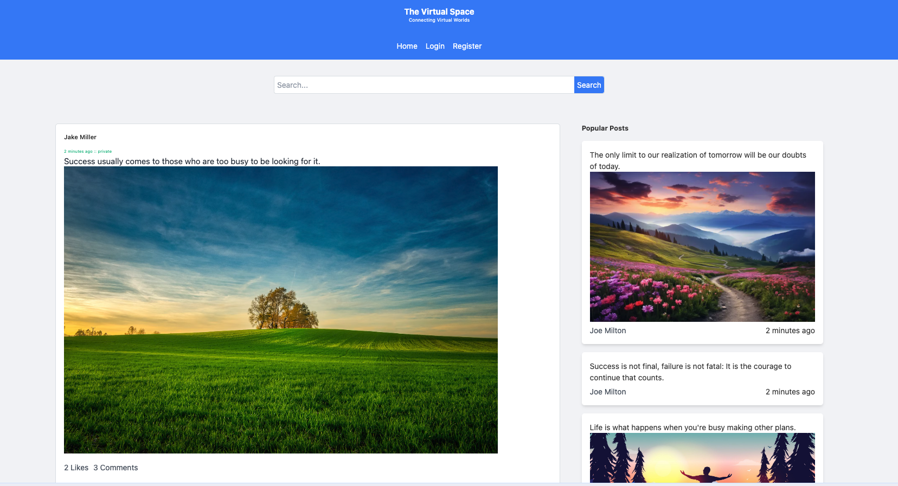

# The Virtual Space social network

## Current features
- User: sign-up, sign-in, logout
- Logged in user: create post, like, comment
- Non Logged-in user: view posts
- Search: search for post content using searchkiq
- Real-time update: when a new post, comment, or like created, all the users  will be notified and update the view accordingly (using ActionCable)
- Upload file with default ActiveStorage setting

## Pending features
- Update/delete posts
- Update/delete comments
- Like/Unlike a comment
- Friends
- Apply post visibilty scope (public, private, friends...)
- Chat box between friends

## Technical

- Rails 7 with default sqlite database setting
- Devise (default config with some custom view files)
- ActionCable via Redis
- Searchkiq with Elasticsearch
- Pagination with will_paginate
- Summernote editor (embed directly instead of using gem) with upload image feature (basic ActiveStorage)
- jQuery, Bootstrap, Tailwind css
- Basic tests

## Setup

1. Start redis and elasticsearch services
   ```bash
   docker-compose up -d
   ```

2. Compile JS
  ```bash
  yarn install
  yarn build
  ```

3. Install gems
   ```bash
   bundle install
   ```
4. Setup db and seed sample data
   ```bash
   rails db:migrate db:seed
   ```
5. Run rails server
   ```bash
   rails s
   ```
6. Go to the dashboard at http://localhost:3000
7. Login to a sample account (created via db:seed) http://localhost:3000/users/sign_in
   - user1:
     - email: user1@example.com
     - password: password1
   - user2:
     - email: user2@example.com
     - password: password2
8. Use app features
   - Create new post
   - Like a post
   - Comment on a post
   - Search for post content
   - Real-time update with multiple logged in users in different browsers

9. Login as admin user:
    - email: admin@example.com
    - password: admin123
10. Manage users/posts/comments at admin screen http://localhost:3000/admin/users

## Sample screenshots

Screenshot 1 (not logged-in)



Screenshot 2 (not logged-in)


Screenshot 3 (logged-in)


Screenshot 4 (Admin users)

